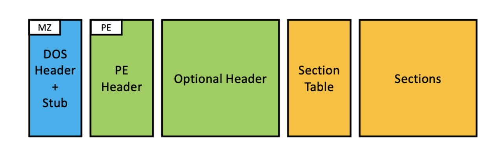
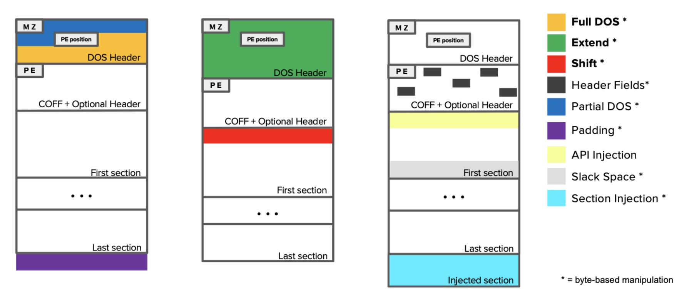

# Adversarial exemples: a survey and experimental evaluation of practical attacks on machine learning for windows malware detection

## Introduction
In particular, we encode three novel practical manipulations that exploit the ambiguity in the specifications of the Windows PE file format: Full DOS that edit all the available bytes inside the DOS header; Extend, which enlarges the DOS header, thus enabling manipulation of these extra DOS bytes; and Shift, which shifts the content of the first section, carving additional space for the adversarial payload.

***

## background

### Windows Portable Executable
The Windows Portable Executable (PE)5format specifies how executable programs are stored as a file on disk. The OS loader parses this structure and maps the code and data into memory, following the directives specified by the header of the file. We show the components of the format in Figure 1.

*Fig. 1. The Windows PE file format. Each colored section describes a particular characteristic of the program*

- **DOS Header and Stub**. The DOS header contains metadata for loading the executable inside a DOS environment, while the DOS Stub is made up of few instructions that will print “This program cannot be run in DOS mode” if executed inside a DOS environment. These two components have been kept to maintain compatibility with older Microsoft operating systems. From the perspective of a modern application, the only relevant locations contained inside the DOS Header are (i) the magic number MZ, a two-byte signature of the file, and (ii) the four-byte integer at offset 0x3c, that works as a pointer to the actual header. If one of these two values is altered for some reason, the program is considered corrupted, and it will not be executed by the OS.

- **PE Header**. It is the real header of the program, and it contains the magic number PE and the characteristics of the executable, such as the target architecture that can run the program, the size of the header and the attributes of the file.

- **Optional Header**. Not optional for executables and DLLs, it contains the information needed by the OS for loading the binary into memory. Among these fields, the Optional Header specifies the (i)file alignment, that acts as a constraint on the structure of the executable since each section of the program must start at an offset multiple to that field, and the (ii) size of headers that specifies the amount of bytes that are reserved to all the headers of the programs, and it must be a multiple of the file alignment. Lastly, the optional header contains offsets that point to useful structures, like the Import Table needed by the OS for resolving dependencies, the Export Table to find functions that can be referenced by other programs, and more.

- **Section Table**. It is a list of entries that indicates the characteristics of each section of the program. Each section entry has a name, an offset to the location inside the binary, a virtual address where the content should be mapped in memory, and the characteristics of such content (i.e. is read-only, write-only, or it is executable, and more).

- **Sections**. These are contiguous chunks of bytes, loaded in memory by the loader after while parsing the Section Table.
To name a few, there is the code of the program (.text section), initialized data (.data), read-only constants (.rdata), and counting. To maintain the alignment specified inside the Optional Header, these sections might be zero-padded to match the format constraint. It is clear that, even without executing the program contained inside a file, it is possible to infer some useful information from its headers, imports, exports, and sections.

***
## Adversarial Exemples: Practical Attacks on Windows Malware Detections

### Practical Manipulations

T hese manipulations are functions that change the representation of a program, by exploiting redundancies and technicalities of the file format, while leaving their functionality intact. In particular, the attacker aims either to find suitable locations where they can freely alter bytes without breaking the structure, or to create space where they can inject the adversarial payload. A simplified graphical representation of all these strategies is given in Figure 2. The colored areas highlight the locations where the adversarial payload can be injected, and the length of the boxes indicates how the content is shifted before injection.

*Fig. 2. Graphical representation of the locations perturbed by different attack strategies with the injection of adversarial payloads (shown in colors). The three manipulation strategies proposed in this work are highlighted in bold.*

#### Novel manipulations.
We discuss here the three novel practical manipulations of Windows programs introduced in this work: Full DOS, Extend, and Shift. These manipulations are all byte-based, i.e., they can manipulate byte values independently.

- **Full DOS**: This manipulation edits all the bytes contained in the DOS header. Since the only two important fields in the DOS header are the magic number MZ and the 4 byte-long integer at offset 0x3c, all the other bytes can be used by the attacker to inject the adversarial payload. Demetrio et al. originally proposed a mutation applied between the magic number and the real header offset, even though, actually, the whole DOS header can be manipulated without corrupting the program. In particular, when the program is launched, the control is passed to the loader, which starts parsing the executable. After checking the magic number, it reads the PE offset and it jumps to the metadata of the PE header, skipping the parsing of the DOS header and stub, thus preserving the functionality of the input program.
- **Extend**: This manipulation aims to create new space inside the executable by enlarging the DOS header, where the adversary can inject the adversarial noise without breaking the structure of the executable. To this end, the attacker increases the offset to the PE header, forcing the loader to look up for it further ahead inside the binary, and then they can extend and manipulate this new enlarged DOS header at their will. Also, the loader will load into memory each header of the program, starting from the DOS header until the end of the Optional header, by looking at a field called size of headers.
- **Shift**: This manipulation aims to create new space inside the executable by shifting the content of the first section and injecting there the adversarial noise. We recall from Section 2.1 that each section entry specifies an offset inside the binary where the loader can find the content of that section. Each offset is multiple of the file alignment, specified in the Optional Header. The job of the loader is to read these entries, and load into memory the content of each section, by looking inside the binary at the offset specified by the entry.

### Previously-proposed Practical Manipulations.

#### Byte-based Manipulations.

- **Header Fields**: This manipulation technique modifies specific fields contained inside the PE and the Optional Header, e.g., changing the name of each section by editing the corresponding section entries. Each byte in these fields can be independently and arbitrarily changed.
- **Partial DOS**: This manipulation alters the first 58 bytes of the unused DOS header, starting from the byte after the magic number MZ to the offset to PE header.
- **Slack Space**: This manipulation fills the space between sections. When the program is compiled, to keep the beginning of each section aligned to the value specified in the header, the compiler appends a trail of zero bytes to each section to fill the gap. This space can be used to inject the adversarial payload.
- **Padding**: This manipulation appends padding bytes at the end of the input file.
- **Section Injection**: This manipulation creates a new section that is injected inside the target executable, along with a new section entry inside the Section Table. Accordingly, this manipulation does not only change the byte distribution exhibited by the input program, but also its structure.

#### Other Manipulations.
- **API Injection**: This manipulation aims to add entries inside the Import Table of an executable, causing the OS to include more APIs during the loading process. While the attacker can not remove APIs, as this would break the functionality of the program, they can inject API imports that will not be used by the program. In this case, the injection is made up of a complete entry that can not contain arbitrary values, but rather it must comply with a specific format.
- **Binary Rewriting**: These manipulations allow the attacker to alter the code of the program by different means, spanning from substituting a set of instructions with others that are semantically equivalent (e.g. replacing additions with subtraction, and changing signs of the values), to encode all the program inside another one (packing). It is thus clear that, also in this case, the input bytes corresponding to the location affected by this manipulation can not be changed independently from each other. We refer the reader to for more details on how binary-rewriting techniques can be used to craft adversarial malware.