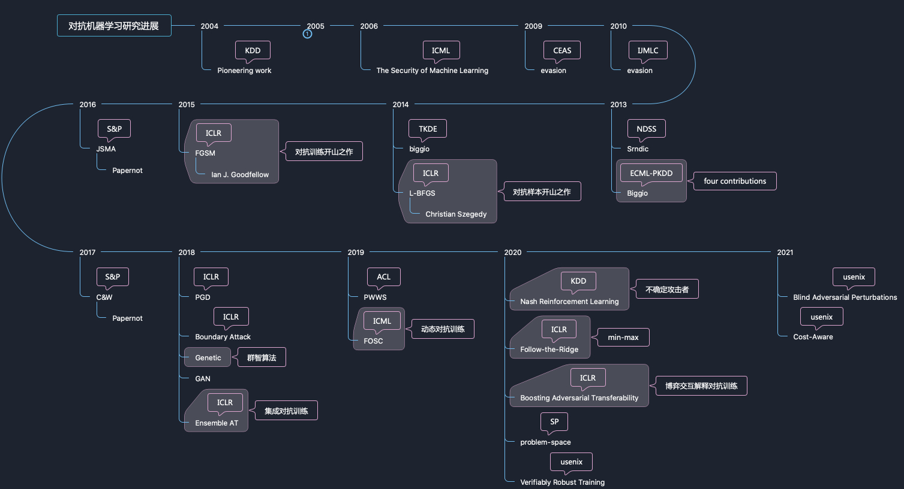

# Adversarial Machine Learning

## Library
- [adversarial-robustness-toolbox
](https://github.com/Trusted-AI/adversarial-robustness-toolbox)
- [Cleverhans](https://github.com/cleverhans-lab/cleverhans)
- [foolbox](https://github.com/bethgelab/foolbox)
- [DEEPSEC](https://github.com/ryderling/DEEPSEC)

***
## Material
- [深度学习对抗鲁棒性增强技术研究白皮书](https://mp.weixin.qq.com/s/m5nEUfwQZKIP_h02MgSZkw)
- [什么是对抗样本？——稳健性和泛化性的交集](https://zhuanlan.zhihu.com/p/269203978)
- [模型的Robustness和Generalization是什么关系？](https://www.zhihu.com/question/410332622/answer/1382400360)
- [什么是范数？](https://zhuanlan.zhihu.com/p/67120415)
- [对抗正则化——盲人摸象还是对症下药？](https://zhuanlan.zhihu.com/p/337880063)

***
## Adversarial Attack RoadMap

- [Adversarial classification]() KDD2004
- [Adversarial learning]() KDD2015
- [Can Machine Learning Be Secure?]() AsiaCCS2016
- [Feature weighting for improved classifier robustness]()
- [Multiple classifier systems for robust classifier design in adversarial environments]() 2010JMLC
- [Detection of Malicious PDF Files Based on Hierarchical Document Structure]() NDSS2013
- [Evasion Attacks against Machine Learning at Test Time]() ECML-PKDD2013
- [Practical Evasion of a Learning-Based Classifier:
A Case Study]() S&P2014
- [Intriguing properties of neural networks]() ICLR2014 L-BFGS 图像对抗样本开山之作
- [Explaining and Harnessing Adversarial Examples]() ICLR2015 FGSM
- [The limitations of deep learning in adversarial settings]() S&P2016 JSMA
- [Towards evaluating the robustness of neural networks]() 2017S&P C&W
- [Adversarial examples in the physical world]() ICLR2017 BIM
- [Towards Deep Learning Models Resistant to Adversarial Attacks]()ICLR2018 PGD
- [Breaking certified defenses: Semantic adversarial examples with spoofed robustness certificates]() ShadowAttack
- [ShapeShifter: Robust Physical Adversarial Attack on Faster R-CNN Object Detector]()ECML/PKDD2018 ShapeShifter

## Adversarial Defense
- [Explaining and Harnessing Adversarial Examples]() ICLR2015
- [Adversarial Machine Learning at Scale]() ICLR2017 使用一般的原始训练集图片和一半的对抗样本进行训练
- [Ensemble Adversarial Training: Attacks and Defenses]() ICLR2018
- [Adversarial Training and Robustness for Multiple Perturbations]() NeurlIPS 2019
- [Virtual Adversarial Training: A Regularization Method for Supervised and Semi-Supervised Learning]()
- [On the Convergence and Robustness of Adversarial Training]() ICML2019
- [Learning with a strong adversary]() ICLR2016
- [Adversarial Weight Perturbation Helps Robust Generalizations]() NIPS2020

## Adversarial Existence

### 损失函数的线性特性
- [Explaining and Harnessing Adversarial Examples]()

### 样本像素空间维度
- [Exploring the Space of Adversarial Images]()
- [The space of transferable adversarial examples]()

### 全局通用扰动的存在性
- [Universal Adversarial Perturbations]()
- [Analysis of universal adversarial perturbations]()

### 非鲁棒性特征
- [Adversarial examples are not bugs, they are features]() NIPS2019
- [Noise or Signal: The Role of Image Backgrounds in Object Recognition]() ICLR2021
- [Distilling Robust and Non-Robust Features in Adversarial Examples by Information Bottleneck]() NIPS2021
- [Robustness May Be at Odds with Accuracy]() ICLR2019

***

